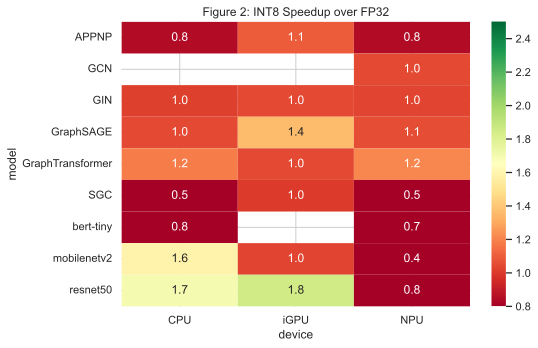

# Benchmarking GNN Inference on the Intel Core Ultra NPU: A Latency, Quantization, and Energy Analysis

**A reproducible characterization of GNN, CNN, and transformer inference on a power-constrained Intel Meteor Lake client platform.**

[](https://ieee-hpec.org/)
[](https://yusufarbc.github.io/intel-npu-gnn-benchmarking/)
[](paper/paper.pdf)
[](LICENSE)

## The study in 30 seconds

| Challenge | Approach | Experiment | Main outcome |
|---|---|---|---|
| Client NPUs are designed around regular tensor execution, while GNNs combine sparse matrix operations, Gather/Scatter, and indirect memory access. | Export the same workloads to ONNX and measure end-to-end inference across the CPU, Arc iGPU, and AI Boost NPU through OpenVINO. | **14 models** × **3 OGB datasets** × **3 backends**, with FP32/INT8 variants, provider tracing, and selected package-power measurements. | The **NPU leads on supported dense FP32 models**; the **iGPU generally leads the evaluated GNNs**. INT8 must be validated per model. |

> **Takeaway:** accelerator availability is not the same as accelerator execution. A requested NPU configuration may regress, partially execute on the CPU, execute entirely on the CPU, or fail compilation.

### Key measurements

<p align="center">
  
</p>

<p align="center"><em>FP32 latency across the CPU, integrated GPU (iGPU), and NPU. Lower is better.</em></p>

<p align="center">
  
</p>

<p align="center"><em>INT8 speedup over FP32. Values below 1.0 indicate a latency regression.</em></p>

<table width="100%">
  <thead>
    <tr>
      <th width="50%">Dense FP32 highlights</th>
      <th width="50%">Sparse GNN and INT8 highlights</th>
    </tr>
  </thead>
  <tbody>
    <tr>
      <td>
        <strong>MobileNetV2:</strong> 1.90 ms on NPU, <strong>4.5x</strong> vs. CPU<br>
        <strong>ResNet50:</strong> 3.94 ms on NPU, <strong>8.0x</strong> vs. CPU<br>
        <strong>ViT-Tiny:</strong> 9.10 ms on NPU, <strong>11.4x</strong> vs. CPU
      </td>
      <td>
        <strong>GraphTransformer:</strong> 6.03 ms iGPU vs. 10.72 ms NPU<br>
        <strong>SGC INT8 on NPU:</strong> 173.90 ms, <strong>2.2x slower</strong> than FP32<br>
        <strong>GAT/GATv2 INT8:</strong> NPU compilation failed
      </td>
    </tr>
  </tbody>
</table>

### Deployment decision guide

| Workload or objective | Recommended starting point | Required verification |
|---|---|---|
| Supported, regular FP32 vision model | **NPU** | Confirm native NPU assignment and measure latency |
| Sparse GNN represented by this benchmark | **iGPU** | Compare against CPU and NPU on the target graph |
| INT8 deployment | **No universal winner** | Measure FP32 and INT8; inspect compilation and provider traces |
| Energy-sensitive inference | **Model-specific evaluation** | Measure energy per inference; do not infer isolated NPU power from package telemetry |

> In raw CSV files and previously generated chart legends, OpenVINO's device identifier `GPU` denotes the integrated Arc **iGPU**—not a discrete GPU. Regenerated figures use `iGPU` as the display label.

## Conference poster

This repository is the interactive companion to the paper and virtual poster presented in the **IEEE HPEC 2026 Graph Analytics and Network Science / Application Benchmarking poster session**.

| Start here | Purpose |
|---|---|
| [Interactive poster](https://yusufarbc.github.io/intel-npu-gnn-benchmarking/) | Screen-shareable presentation for the Zoom poster session |
| [Camera-ready paper](paper/paper.pdf) | Complete methodology, analysis, limitations, and references |
| [LaTeX source](paper/paper.tex) | Auditable manuscript source |
| [Maintained dependencies](requirements.txt) | Current environment for new benchmark runs |
| [Benchmark notebook](npu_gnn_benchmarking.ipynb) | End-to-end experiment and figure pipeline |
| [Aggregated results](results/figures/) | CSV summaries and publication figures |
| [Methodology notes](docs/methodology.md) | Short experimental reference |
| [Citation metadata](CITATION.cff) | Preferred repository citation |

For a poster discussion, begin with the interactive poster. Use the notebook, CSV files, and analysis scripts as supporting evidence when a visitor asks about implementation or reproducibility.

## Results at a glance

The reported values are means across the three evaluated OGB datasets.

| Finding | Evidence | Practical implication |
|---|---:|---|
| Dense FP32 inference benefits from NPU execution | MobileNetV2: **1.90 ms, 4.5x vs. CPU**; ResNet50: **3.94 ms, 8.0x**; ViT-Tiny: **9.10 ms, 11.4x** | Use the NPU for supported, regular dense models when latency is the priority |
| The NPU provides little GNN latency benefit | GraphTransformer: **10.72 ms NPU**, **10.69 ms CPU**, **6.03 ms iGPU** | Prefer the iGPU for the evaluated GNN workloads |
| INT8 can regress on the NPU | SGC: **78.59 ms FP32** versus **173.90 ms INT8** | Benchmark both precisions; do not assume INT8 is faster |
| Device requests do not guarantee native execution | MPNN executed on CPU in the requested NPU configuration; several INT8 graphs did not compile | Inspect execution-provider traces before reporting accelerator results |
| Energy gains are model-dependent | CPU INT8 reduced GCN energy by **18.4%** but increased MPNN energy by **59%** | Treat quantization as a model-specific systems decision |

The study evaluates **nine GNNs and five dense baselines**, **three Open Graph Benchmark datasets**, and the **CPU, integrated GPU (iGPU), and NPU** in an Intel Core Ultra 5 125H system.

## Experimental scope

| Dimension | Evaluated configuration |
|---|---|
| Processor | Intel Core Ultra 5 125H (Meteor Lake, 28 W client platform) |
| Accelerators | Intel Arc iGPU (Xe-LPG) and Intel AI Boost NPU 3720 |
| Memory and OS | 16 GB LPDDR5x, Windows 11 |
| GNN models | GCN, GAT, GATv2, GIN, GraphSAGE, SGC, APPNP, GraphTransformer, MPNN |
| Dense baselines | ResNet50, MobileNetV2, EfficientNet-B0, ViT-Tiny, BERT-Tiny |
| Graph datasets | ogbn-arxiv, ogbn-products, ogbn-proteins |
| Timing protocol | Batch size 1; 5 warm-ups; 100 timed iterations; 3 independent runs |
| Measurements | Latency, derived throughput, INT8/FP32 speedup, provider assignment, graph optimization, and selected package-power measurements |

Latency includes execution-provider dispatch and required host-device transfers after warm-up. Dataset loading, preprocessing, model conversion, and one-time graph compilation are outside the timed region.

## Software environment

The accepted paper reports **OpenVINO 2024.1** and **ONNX Runtime 1.18**. These are the authoritative versions for interpreting every published number in this repository.

The actively maintained [`requirements.txt`](requirements.txt) may advance after publication. It supports new benchmark runs, but compiler behavior and operator coverage can change between releases. A run with a newer environment is a **new measurement**, not a bit-for-bit reproduction of the paper. Record the OpenVINO version, ONNX Runtime version, NPU driver, firmware, and hardware SKU whenever reporting new results.

The historical core versions are recorded in the camera-ready paper, but the original experiment did not preserve a complete lockfile for every transitive notebook dependency. The root [`requirements.txt`](requirements.txt) therefore represents the maintained environment for new runs rather than a bit-for-bit reconstruction of the 2024.1/1.18 software stack.

## Quick start

### 1. Clone and create an environment

```bash
git clone https://github.com/yusufarbc/intel-npu-gnn-benchmarking.git
cd intel-npu-gnn-benchmarking

python -m venv .venv
```

Activate it on Windows:

```powershell
.venv\Scripts\Activate.ps1
```

Or on Linux/macOS:

```bash
source .venv/bin/activate
```

### 2. Install the maintained development dependencies

```bash
python -m pip install --upgrade pip
python -m pip install -r requirements.txt
```

### 3. Run the notebook

```bash
jupyter notebook npu_gnn_benchmarking.ipynb
```

Run the cells from top to bottom. The notebook downloads OGB datasets, prepares ONNX models when needed, checks available OpenVINO devices, executes the benchmark matrix, and regenerates the aggregated tables and figures. Treat results from this maintained environment as a new experiment unless the paper's core versions are restored.

> NPU and iGPU measurements require a compatible Intel Core Ultra system with working OpenVINO drivers. CPU-only execution is available on other x86 systems, but it does not reproduce the paper's cross-device comparison.

## Benchmark workflow

```text
OGB datasets + model definitions
              |
              v
       FP32 ONNX export
              |
              +----> dynamic INT8 quantization
              |
              v
 CPU / iGPU / NPU execution with provider tracing
              |
              v
 latency + throughput + fallback + power summaries
              |
              v
       publication figures and CSV tables
```

The default full matrix covers 14 models x 3 datasets x 3 devices x 2 precisions where compilation succeeds. A complete run can take several hours. Set `SOCWATCH_ENABLED = False` in the notebook when package-power collection is unnecessary.

## Standalone analysis commands

```bash
# Export FP32 models and create available INT8 variants
python analysis/model_prep.py

# Run one model/device scalability experiment
python analysis/scalability_analyzer.py --model GCN --device NPU --iterations 100

# Sweep graph density across devices
python analysis/density_sweep.py --devices CPU,GPU,NPU
```

The command-line interface uses OpenVINO's device name `GPU`; the paper and prose call this device the **iGPU** to distinguish it from a discrete GPU.

## Results and artifacts

| Path | Contents |
|---|---|
| [`results/figures/master_results.csv`](results/figures/master_results.csv) | Merged latency measurements |
| [`results/figures/unified_summary.csv`](results/figures/unified_summary.csv) | Per-model/device/precision summaries |
| [`results/figures/comparison_table.csv`](results/figures/comparison_table.csv) | Cross-device speedups |
| [`results/figures/summary_stats.csv`](results/figures/summary_stats.csv) | Statistical summaries |
| [`results/figures/`](results/figures/) | PNG and SVG figures |
| [`analysis/`](analysis/) | Benchmarking, profiling, and plotting code |
| [`docs/`](docs/) | Methodology and implementation notes |
| [`showcase/`](showcase/) | Slidev source for the interactive poster |

Large generated models, downloaded datasets, and some raw runtime artifacts may be excluded from version control. The notebook regenerates them.

## Interpretation boundaries

- Results characterize one Intel Core Ultra 5 125H system, not every Meteor Lake or later-generation NPU.
- The selected GNNs are established systems-research workloads; the suite does not cover large graph transformers, temporal graphs, heterogeneous graphs, or recommendation systems.
- FP32 and INT8 are the evaluated precisions, not a claim that the hardware supports only those formats.
- NPU power could not be isolated with the available telemetry. Reported energy comparisons cover selected CPU and iGPU configurations and include background package activity.
- Compilation failure, CPU execution, and successful native NPU execution are different outcomes and are reported separately.
- Quantized-model accuracy is outside this performance-characterization study.

## Repository structure

```text
.
|-- analysis/                 Benchmark, profiling, and plotting modules
|-- data/                     Dataset documentation and local downloads
|-- docs/                     Methodology and technical notes
|-- models/                   Model-generation documentation and local exports
|-- paper/                    IEEE LaTeX source, bibliography, and paper PDF
|-- results/                  Aggregated data, figures, and runtime artifacts
|-- showcase/                 Slidev interactive-poster source
|-- npu_gnn_benchmarking.ipynb
|-- requirements.txt
`-- CITATION.cff
```

## Citation

If you use the benchmark suite or results, cite the paper and repository metadata in [`CITATION.cff`](CITATION.cff):

```bibtex
@inproceedings{arabaci2026gnnnpu,
  title     = {Benchmarking GNN Inference on the Intel Core Ultra NPU: A Latency, Quantization, and Energy Analysis},
  author    = {Arabaci, Yusuf Talha and Demiral, Emrullah and Acar, Omer Faruk},
  booktitle = {2026 IEEE High Performance Extreme Computing Conference (HPEC)},
  year      = {2026}
}
```

## Authors

- Yusuf Talha Arabacı — Karabük University
- Emrullah Demiral — Karabük University
- Ömer Faruk Acar — Karabük University

Questions and reproducibility reports are welcome through [GitHub Issues](https://github.com/yusufarbc/intel-npu-gnn-benchmarking/issues).

## License

Released under the [MIT License](LICENSE).
