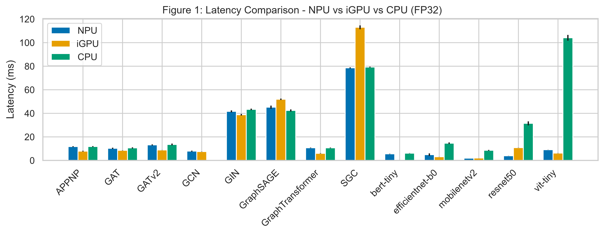

# Benchmarking GNN Inference Bottlenecks on Intel Core Ultra NPUs

[](LICENSE)
[](https://python.org)
[](https://docs.openvino.ai)
[](https://yusufarbc.github.io/intel-npu-gnn-benchmarking/)

A comprehensive benchmarking framework for evaluating Graph Neural Network (GNN) inference on **Intel Core Ultra (Meteor Lake) NPUs**, comparing against CPU and integrated GPU (iGPU) backends under OpenVINO.

> 📄 **Paper:** *Benchmarking GNN Inference Bottlenecks on Intel Core Ultra NPUs* — Yusuf Talha Arabacı, Karabük University  
> 🎯 **Key Finding:** The NPU delivers strong FP32 throughput for dense vision models (MobileNetV2: 1.97ms, ResNet50: 3.92ms), but GNN workloads show limited NPU advantage due to irregular memory access patterns and sparse operator coverage.



---

## Key Features

- **14 Models:** 9 GNNs (GCN, GAT, GATv2, GIN, GraphSAGE, SGC, APPNP, GraphTransformer, MPNN) + 5 dense baselines (ResNet50, MobileNetV2, EfficientNet-B0, ViT-Tiny, BERT-Tiny)
- **3 Hardware Backends:** CPU, integrated GPU (Xe-LPG), and NPU (Intel AI Boost)
- **3 Real-World Datasets:** ogbn-arxiv, ogbn-proteins, ogbn-products from the Open Graph Benchmark
- **INT8 Quantization Analysis:** FP32 vs INT8 speedup across all models and devices
- **Operator Profiling:** Per-operator CPU fallback detection and ONNX operator composition analysis
- **Publication-Ready Figures:** 8 IEEE-format figures (PNG + SVG, 300 DPI)
- **Accompanying Paper:** LaTeX source for IEEE conference submission
- **Interactive Presentation:** Web-based Slidev presentation ([live demo](https://yusufarbc.github.io/intel-npu-gnn-benchmarking/))

## Project Structure

| Directory | Description |
|-----------|-------------|
| `analysis/` | Python scripts for benchmarking, profiling, and analysis |
| `data/` | OGB graph datasets (excluded from git — downloaded automatically) |
| `docs/` | Technical documentation and methodology guides |
| `models/` | Pre-exported ONNX models (excluded from git — regenerate with `model_prep.py`) |
| `paper/` | LaTeX paper source and compiled PDF |
| `results/` | Benchmark outputs, CSV matrices, and publication figures |
| `showcase/` | Interactive Slidev presentation source and assets |

## Hardware Requirements

This project requires an **Intel Core Ultra (Meteor Lake)** system:

| Component | Spec Used |
|-----------|-----------|
| **CPU** | Intel Core Ultra 5 125H |
| **NPU** | Intel AI Boost (NPU 3720, VPUX37XX) |
| **iGPU** | Intel Arc Graphics (Xe-LPG) |
| **OS** | Windows 11 (NPU driver required) |

> **Note:** Benchmarks can be run in CPU-only mode on any x86 system. NPU and iGPU results require an Intel Core Ultra platform with OpenVINO drivers.

## Requirements

| Dependency | Version | Purpose |
|-----------|---------|---------|
| **Python** | ≥ 3.10 | Runtime |
| **OpenVINO** | 2025.4.1 | NPU/GPU/CPU inference backend |
| **ONNX Runtime** | 1.24.4 | Model execution with OpenVINO EP |
| **PyTorch** | 2.11.0 | GNN model definition and export |
| **Intel SoCWatch** | — | Energy/power profiling (optional) |

> **SoCWatch** is optional. The notebook auto-detects it. Set `SOCWATCH_ENABLED = False` in the first notebook cell to disable energy profiling and halve benchmark runtime.

## Installation

```bash
# 1. Clone the repository
git clone https://github.com/yusufarbc/intel-npu-gnn-benchmarking.git
cd intel-npu-gnn-benchmarking

# 2. Create and activate a virtual environment
python -m venv .venv
.venv\Scripts\activate   # Windows
# source .venv/bin/activate  # Linux/macOS

# 3. Install dependencies
pip install --upgrade pip
pip install -r requirements.txt
```

## Usage — Reproducing the Paper Results

> **⚠️ Hardware requirement:** NPU and iGPU benchmarks require an **Intel Core Ultra (Meteor Lake)** processor. CPU-only results can be reproduced on any modern x86 system.

### Step-by-step

```bash
# Activate environment
.venv\Scripts\activate

# Launch Jupyter
jupyter notebook npu_gnn_benchmarking.ipynb
```

### Notebook Cells Overview

Run cells **sequentially** from top to bottom:

| Stage | Cells | Description |
|-------|-------|-------------|
| **Config** | Cell 1 | Edit model list, devices, iterations, SoCWatch toggle |
| **Stage 0** | Cells 2–4 | Imports, helper functions |
| **Stage 0-B** | Cell 5 | ⚡ **Auto-downloads OGB datasets & generates ONNX models** (if missing) |
| **Stage 1-A/B/C** | Cells 6–9 | Dataset metadata, model inventory, hardware health check |
| **Stage 2** | Cells 10–13 | **Unified batch benchmark** — all models × datasets × devices × precisions |
| **Stage 3-A/B/C** | Cells 14–17 | Merge results, comparison tables, summary statistics |
| **Stage 4** | Cells 18–39 | 8 publication-ready figures (PNG + SVG) |

> ⚡ **Datasets and models are downloaded/generated automatically** by Stage 0-B. No manual download needed.  
> ⏱️ Full benchmark run (14 models × 3 datasets × 3 devices × 2 precisions) takes **2–4 hours** with SoCWatch enabled.

### Outputs

All generated artifacts are saved to:

```
results/
├── figures/                     # Publication figures (PNG + SVG, 300 DPI)
├── master_results.csv           # Full latency matrix
├── unified_summary.csv          # Aggregated per-model summaries
├── comparison_table.csv         # Cross-device comparison table
└── summary_stats.csv            # Statistical summaries
```

### Standalone Scripts

Individual analysis scripts can also be run directly:

```bash
# Generate ONNX models (FP32 + INT8 quantized)
python analysis/model_prep.py

# Run scalability analysis for a specific configuration
python analysis/scalability_analyzer.py --model GCN --device NPU --iterations 100

# Sweep graph density
python analysis/density_sweep.py --devices CPU,GPU,NPU
```

## Key Findings

- The NPU delivers strong FP32 performance for dense vision models (MobileNetV2: **1.97ms**, ResNet50: **3.92ms**)
- GNN workloads show **limited NPU advantage** (within 15% of CPU latency on average)
- INT8 quantization **degrades NPU latency** for most GNNs (SGC INT8 is 2× slower than FP32 on NPU)
- Attention-based GNNs (GAT, GATv2) **fail INT8 compilation entirely** due to unsupported scatter/gather operator patterns
- Graph density shows **no correlation** with NPU latency — static-shape compilation fixes execution time regardless of actual edge count

## Citation

If you use this benchmark in your research, please cite:

```bibtex
@software{arabaci2026npu,
  author    = {Arabac{\i}, Yusuf Talha},
  title     = {Benchmarking GNN Inference Bottlenecks on Intel Core Ultra NPUs},
  year      = {2026},
  url       = {https://github.com/yusufarbc/intel-npu-gnn-benchmarking},
  license   = {MIT}
}
```

## License

This project is licensed under the MIT License — see the [LICENSE](LICENSE) file for details.

---

*Developed by Yusuf Talha Arabacı — Karabük University*
