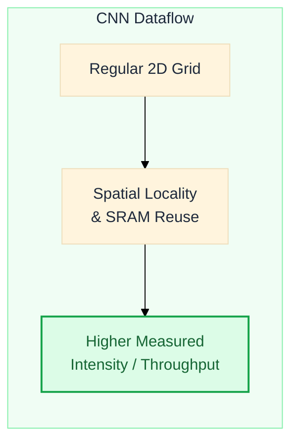
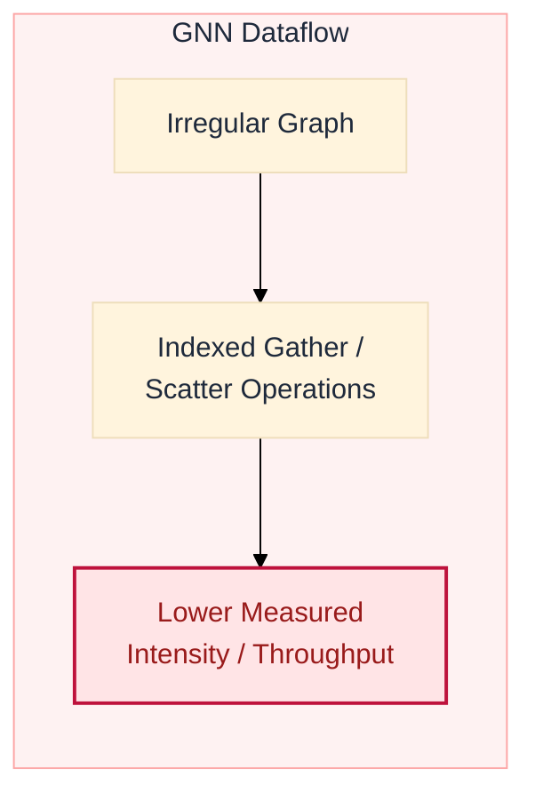

  

    

      <h1 class="text-3xl font-extrabold text-blue-800 leading-tight">
        Benchmarking GNN Inference on the Intel Core Ultra NPU
      </h1>
      <h4 class="text-slate-500 font-medium text-sm mt-1">A Latency, Quantization, and Energy Analysis</h4>
      <h3 class="text-slate-600 font-semibold mt-2 text-lg leading-relaxed">
        Heterogeneous Edge AI Analysis on Meteor Lake SoC
      </h3>
    

    

      

        
        

          Figure 1: Intel Meteor Lake heterogeneous SoC
        

      

    

  

  

    

      Yusuf Talha ARABACI, Emrullah DEMİRAL, Ömer Faruk ACAR
    

    

      Department of Software Engineering, Karabük University, Karabük, Turkey
    

    

      yusuftalhaarabaci@hotmail.com | emrullahdemiral@karabuk.edu.tr | farukacar@karabuk.edu.tr
    

  

<Glossary :terms="['npu', 'igpu', 'meteor-lake', 'soc', 'lpe-core']" />

---
layout: default
class: rq-slide
---

## Agenda
### Presentation Outline

  

    

      1
      
<strong>Background &amp; Motivation</strong> — NPU promise, GNN challenges, study goals

    

  

  

    

      2
      
<strong>Methodology</strong> — Hardware platform, 14 models, 3 OGB datasets, measurement protocol

    

  

  

    

      3
      
<strong>Results</strong> — Latency, INT8 quantization, operator analysis, optimization sensitivity, scaling, and package power

    

  

  

    

      4
      
<strong>Key Findings &amp; Bottlenecks</strong> — INT8 regressions, assignment exceptions, comparative landscape

    

  

  

    

      5
      
<strong>Practical Guidance</strong> — Deployment recommendations, future work, limitations

    

  

<Glossary :terms="['npu', 'gnn', 'openvino']" />

---
layout: default
---

## The Paradox of Edge AI Acceleration
### Dense Optimization vs. Sparse Reality

  

    <h3 class="text-blue font-semibold">1. Hardware Hype (Dense)</h3>
    <ul>
      <li>Modern SoCs (Intel Meteor Lake, Apple M-series, Qualcomm Snapdragon) integrate Neural Processing Units (NPUs).</li>
      <li>NPUs excel at <strong>dense, regular computations</strong> (e.g., 2D grid convolutions in CNNs, matrix multiplies in Transformers).</li>
      <li>They rely on high <strong>spatial locality</strong> and predictable data streaming to maximize on-chip SRAM reuse.</li>
    </ul>
  

  

    <h3 class="text-rose font-semibold">2. Graph Reality (Sparse)</h3>
    <ul>
      <li>GNN neighborhood aggregation aggregates node features irregularly:</li>
    </ul>
    

      <KaTeX math="h_v^{(l+1)} = \text{UPDATE}^{(l)} \left( h_v^{(l)}, \text{AGGREGATE}^{(l)} \left( \{ h_u^{(l)} : u \in \mathcal{N}(v) \} \right) \right)" display />
    

    <ul>
      <li>Computations rely on sparse-times-dense multiplication (SpDMM), a form of SpMM:</li>
    </ul>
    

      <KaTeX math="Y = A \cdot X" display />
    

    <ul>
      <li>Memory accesses are dynamic and sparse, which can reduce locality and prefetch efficiency.</li>
      <li><strong>Interpretation:</strong> Irregular indexing and reduced locality are plausible contributors; this study does not directly measure memory traffic or NPU stall cycles.</li>
    </ul>
  

<Glossary :terms="['gnn', 'compute-bound', 'memory-bound', 'stalls', 'locality', 'scatter-gather']" />

---
layout: default
---

## Key Technical Inquiries
### Core Research Questions

  

    
RQ 1: On-Device Efficiency &amp; Parity

    
How efficient are consumer NPUs for sparse GNN workloads vs. CPU and iGPU on laptops?

  

  

    
RQ 2: Quantization: Limited and Negative Returns

    
Does INT8 reduce NPU latency consistently, or does it regress for some sparse GNN workloads?

  

  

    
RQ 3: Compiler Maturity &amp; Operator Fusion Limits

    
How robust is OpenVINO when lowering Gather/Scatter onto NPU microarchitectures?

  

<Glossary :terms="['openvino', 'operator-fusion', 'cpu-fallback', 'scatter-gather', 'ort', 'ptq', 'dynamic-quantization']" />

---
layout: default
class: compact-slide
---

## Dense vs. Sparse Dataflow
### Visual Comparison

<Glossary :terms="['compute-bound', 'memory-bound', 'scatter-gather']" />

---
layout: default
---

## Hardware &amp; Software Methodology
### Experimental Configuration

  

    <h3 class="font-semibold text-blue">Hardware Platform</h3>
    <ul>
      <li><strong>Processor:</strong> Intel Core Ultra 5 125H (Meteor Lake)</li>
      <li><strong>Backends:</strong>
        CPU 14 Cores (4P+8E+2LPE)
        iGPU 7 Xe-cores
        NPU AI Boost 3720
      </li>
      <li><strong>Memory:</strong> 16 GB LPDDR5x</li>
    </ul>
  

  

    <h3 class="font-semibold text-blue">Software Stack</h3>
    <ul>
      <li><strong>Framework:</strong> OpenVINO 2024.1 + ONNX Runtime 1.18</li>
      <li><strong>Protocol:</strong> 5 warm-up, 100 timed iterations, 3 repeats</li>
      <li><strong>Telemetry:</strong> Intel SoCWatch PMT CLI for package power</li>
    </ul>
  

<Glossary :terms="['socwatch', 'warm-up', 'lpddr5x', 'xe-lpg', 'lpe-core', 'pmt']" />

---
layout: default
---

## Evaluated Models and OGB Datasets
### Workload Characterization

  

    <h3 class="font-semibold text-blue">14 Model Architectures</h3>
    

      <strong>Graph Neural Networks (9):</strong>
      <ul>
        <li>Spectral GNNs: GCN, SGC</li>
        <li>Spatial/Expressive GNNs: GIN, GraphSAGE, MPNN</li>
        <li>Propagation/Attentional: APPNP, GAT, GATv2, GraphTransformer</li>
      </ul>
      <strong class="mt-2 block">Dense Baselines (5):</strong>
      <ul>
        <li>Convolutions: ResNet-50, MobileNetV2, EfficientNet-B0</li>
        <li>Attention: ViT-Tiny, BERT-Tiny</li>
      </ul>
    

  

  

    <h3 class="font-semibold text-blue">3 Real-world Source Graphs</h3>
    

      Drawn from the Open Graph Benchmark (dataset_stats.csv):
    

    <table>
      <thead>
        <tr>
          <th>Dataset</th>
          <th>Nodes</th>
          <th>Edges</th>
          <th>Features</th>
          <th>Edges/Node</th>
        </tr>
      </thead>
      <tbody>
        <tr>
          <td><strong>ogbn-arxiv</strong></td>
          <td>169K</td>
          <td>1.16M</td>
          <td>128</td>
          <td>6.9</td>
        </tr>
        <tr>
          <td><strong>ogbn-products</strong></td>
          <td>2.45M</td>
          <td>61.9M</td>
          <td>100</td>
          <td>25.3</td>
        </tr>
        <tr>
          <td><strong>ogbn-proteins</strong></td>
          <td>132.5K</td>
          <td>39.6M</td>
          <td>8</td>
          <td>298.5</td>
        </tr>
      </tbody>
    </table>
    

      Source-graph statistics are shown above. GNN inference uses fixed 2,708-node, 10,000-edge tensors; it is not full-graph execution.
    

  

<Glossary :terms="['sparse-graph', 'dense-graph', 'adjacency-matrix', 'ogb', 'gcn', 'gat', 'sgc', 'gin', 'graphsage', 'mpnn', 'appnp', 'bert', 'resnet', 'mobilenet']" />

---
layout: default
---

## Inference Latency: NPU vs. CPU vs. iGPU
### High-Contrast Performance Profile (FP32)

  

    <ul>
      <li><strong>CPU-relative acceleration:</strong> NPU substantially accelerates selected dense models:
        <ul>
          <li>MobileNetV2: <strong>1.90 ms</strong> NPU vs. 8.60 ms CPU (<strong>4.5&times;</strong>)</li>
          <li>ResNet-50: <strong>3.94 ms</strong> vs. 31.47 ms (<strong>8.0&times;</strong>)</li>
          <li>ViT-Tiny: <strong>9.10 ms</strong> vs. 104.13 ms (<strong>11.4&times;</strong>)</li>
        </ul>
      </li>
      <li><strong>GNN Parity:</strong> CPU and NPU are within &plusmn;6% for several evaluated GNNs.</li>
      <li><strong>iGPU trend:</strong> The iGPU leads most, but not all, evaluated GNNs; GraphTransformer is 6.03 ms on iGPU vs. 10.72 ms on NPU.</li>
      <li><strong>GraphSAGE outlier:</strong> ~45 ms on NPU — 4–6× slower than other GNNs and associated with a heavier Gather/Scatter operator chain; this experiment does not isolate a single cause.</li>
    </ul>
  

  
  

    
    Figure 1: Latency across CPU, iGPU, and NPU backends.
  

<Glossary :terms="['npu', 'igpu', 'memory-bound', 'vit', 'tdp', 'dvfs', 'resnet', 'mobilenet', 'graphsage']" />

---
layout: default
---

## Counter-Intuitive INT8 Quantization Results
### Model-Dependent Conversion and Execution Outcomes

  

    <ul>
      <li><strong>Minor-to-Negative Gains on NPU:</strong> GCN (1.04&times;), GraphSAGE (1.05&times;) marginal; SGC shows <strong>2.2&times; regression</strong> (173.9 vs 78.6 ms).</li>
      <li><strong>Compilation Failures:</strong> GAT, GATv2, and EfficientNet-B0 produce no executable INT8 graph.</li>
      <li><strong>Device-assignment exception:</strong> MobileNetV2 INT8 matches CPU timing, but timing alone does not prove CPU placement. Requested NPU execution must be verified from a retained per-operator trace.</li>
    </ul>
    

      <strong>Interpretation:</strong> The regressions are consistent with irregular data movement, conversion/runtime overheads, and compiler coverage; this benchmark does not isolate one cause.
    

  

  

    
    Figure 2: INT8 speedup heatmap. Red (&lt; 1.0) = degradation.
  

<Glossary :terms="['int8', 'regression', 'cpu-fallback', 'static-shape', 'scatter-gather', 'dynamic-quantization', 'ptq', 'sgc', 'gat', 'graphsage', 'mobilenet', 'resnet', 'bert']" />

---
layout: default
---

## Structured vs. Irregular Attention Patterns
### ViT-Tiny vs. GraphTransformer on NPU

  

    <h3 class="font-semibold text-emerald" style="font-size:0.85rem">Structured (ViT-Tiny)</h3>
    <ul>
      <li>Self-attention over fixed 2D grid patches.</li>
      <li>Regular image-patch operator structure.</li>
      <li><strong>NPU speedup:</strong> 11.4&times; vs CPU</li>
    </ul>
  

  

    <h3 class="font-semibold text-rose" style="font-size:0.85rem">Irregular (GraphTransformer)</h3>
    <ul>
      <li>Attention over dynamic graph neighborhoods.</li>
      <li>Indexed graph-neighborhood operator structure.</li>
      <li><strong>NPU speedup:</strong> 1.0&times; vs CPU</li>
    </ul>
  

  Despite <strong>30&times; fewer parameters</strong> (0.18M vs 5.7M), GraphTransformer gains no NPU speedup. The contrast is consistent with different operator structures, but does not isolate one cause.

<Glossary :terms="['structured-attention', 'irregular-attention', 'vit']" />

---
layout: default
---

## Graph-Optimization Sensitivity
### Extended vs. Disabled ONNX Runtime Optimization

  

    <ul>
      <li><strong>Ratios near 1.0:</strong> The selected ORT graph-optimization setting has limited effect on most configurations.</li>
      <li><strong>Evaluated GNNs:</strong> Model-averaged iGPU ratios span approximately 0.995–1.025&times;; NPU ratios span 0.980–1.018&times;.</li>
      <li><strong>Interpretation:</strong> The small, mixed changes do not support attribution to a particular fusion pass.</li>
    </ul>
  

  

    
    Graph-optimization ratio by device; 1.0 indicates no change.
  

<Glossary :terms="['openvino', 'operator-fusion', 'ort', 'npu', 'igpu']" />

---
layout: default
class: compact-slide
---

## Fixed-Shape Scaling on NPU
### APPNP FP32 Across Separately Compiled Graph Sizes

  

    <ul class="text-sm">
      <li><strong>Measured sweep:</strong> APPNP latency rises from 5.92 ms at 512 nodes to 36.03 ms at 8,192 nodes.</li>
      <li><strong>Scaling:</strong> 16&times; more nodes produces 6.1&times; higher latency at a fixed density of 7 edges/node.</li>
      <li><strong>Scope:</strong> Every point is a separately compiled fixed-shape graph; the sweep does not measure dynamic-shape execution.</li>
    </ul>
    

      <strong>Key observation:</strong> The retained experiment supports graph-size scaling across compiled shapes, not a correlation between source-dataset density and latency.
    

  

  

    

      
      APPNP NPU fixed-shape scaling
    

  

<Glossary :terms="['sparse-graph', 'adjacency-matrix', 'spmm', 'static-shape', 'onnx', 'ort']" />

---
layout: default
---

## Package Power and Latency-Derived Energy Estimate
### SoCWatch Package-Level Telemetry

  

    <ul>
      <li><strong>Formula:</strong> <KaTeX math="E_{\text{inf}} = P_{\text{package}} \times t_{\text{latency}}" /></li>
      <li><strong>GCN on iGPU:</strong> +7.3% average package power vs. CPU, but lower latency, yielding comparable heuristic estimates (86.6 vs. 89.9 mJ).</li>
      <li><strong>INT8 on CPU:</strong> the estimate changes by −18.4% for GCN and +59% for MPNN.</li>
    </ul>
    

      <strong>⚠ Scope:</strong> 2 models, 2 backends. Package power and latency were measured over different scopes, so the product is not a direct active-inference energy measurement. NPU power-rail data were unavailable.
    

  

  

    <table>
      <thead>
        <tr>
          <th>Model</th>
          <th>Config</th>
          <th>Power (mW)</th>
          <th>Lat (ms)</th>
          <th>Estimate (mJ)</th>
        </tr>
      </thead>
      <tbody>
        <tr style="background-color: #f8fafc">
          <td><strong>GCN</strong></td>
          <td>CPU FP32</td><td>11,629</td><td>7.73</td><td>89.9</td>
        </tr>
        <tr>
          <td><strong>GCN</strong></td>
          <td>CPU INT8</td><td>9,675</td><td>7.59</td><td><strong>73.4</strong></td>
        </tr>
        <tr style="background-color: #f8fafc">
          <td><strong>GCN</strong></td>
          <td>iGPU FP32</td><td>12,482</td><td>6.94</td><td>86.6</td>
        </tr>
        <tr>
          <td><strong>MPNN</strong></td>
          <td>CPU FP32</td><td>9,357</td><td>20.23</td><td>189.3</td>
        </tr>
        <tr style="background-color: #f8fafc">
          <td><strong>MPNN</strong></td>
          <td>CPU INT8</td><td>9,139</td><td>32.94</td><td><strong>301.1</strong></td>
        </tr>
      </tbody>
    </table>
  

<Glossary :terms="['socwatch', 'pmt', 'dram', 'gcn', 'mpnn']" />

---
layout: default
class: compact-slide
---

## What Is Associated with the Observed NPU Results?
### Structural Evidence, Toolchain Exceptions, and Limits

  

    

      <h3 class="font-semibold text-rose" style="font-size:0.8rem; margin-bottom:0.2rem">Observed Associations</h3>
      <ul class="text-xs" style="margin:0">
        <li><strong>1. Operator structure:</strong> GNN graphs contain 2–4× more Gather/Scatter and shape-manipulation nodes than vision graphs.</li>
        <li><strong>2. Optimization:</strong> Graph-optimization ratios remain near 1.0; the experiment does not attribute latency to individual compiler passes.</li>
        <li><strong>3. Evidence boundary:</strong> Requested-device labels and provider lists alone do not prove per-operator placement.</li>
      </ul>
    

    

      <h3 class="font-semibold text-blue" style="font-size:0.8rem; margin-bottom:0.2rem">Assignment and Compilation Exceptions</h3>
      <ul class="text-xs" style="margin:0">
        <li><strong>Requested-NPU outcomes:</strong> No retained native-NPU result is available for MPNN FP32; MobileNetV2 INT8 has CPU-like timing but unverified placement.</li>
        <li><strong>Compilation outcome:</strong> GAT, GATv2, and EfficientNet-B0 produce no executable NPU INT8 configuration.</li>
      </ul>
    

  

  

    
    
      ONNX node composition, not execution time. “Other” groups activations, normalization, elementwise arithmetic, and constant/slicing nodes.
    
  

<Glossary :terms="['memory-bound', 'operator-fusion', 'cpu-fallback', 'spmm', 'scatter-gather', 'int8', 'dram', 'gat', 'mpnn', 'mobilenet', 'resnet', 'bert']" />

---
layout: default
---

## Scientific Limitations &amp; Threats to Validity
### Experimental Constraints

  

    <ul>
      <li><strong>Single platform:</strong> Results restricted to Core Ultra 5 125H. Memory SKU variations affect bandwidth.</li>
      <li><strong>Power telemetry:</strong> SoCWatch cannot isolate the NPU rail — the evaluated PMT configuration lacks an NPU power/energy counter. Package-level CPU/iGPU measurements only.</li>
      <li><strong>Future work:</strong> Shunt resistors &amp; oscilloscope for isolated NPU power measurement.</li>
    </ul>
  

  

    <ul>
      <li><strong>Energy estimate:</strong> <KaTeX math="E = P \times t" /> combines different measurement scopes; background and workflow phases are not isolated.</li>
      <li><strong>Statistics:</strong> Sample SD and Student-t intervals use three run means; paired tests were not conducted.</li>
      <li><strong>Inputs:</strong> GNNs use fixed 2,708-node, 10,000-edge tensors, not complete OGB graphs.</li>
    </ul>
  

<Glossary :terms="['socwatch', 'warm-up', 'onnx', 'pmt', 'thermal-throttling', 'dvfs', 'etw']" />

---
layout: default
---

## Practical Guidance for Edge AI Deployments
### System Guidelines and Future Roadmap

  

    
✔ Selected Dense Models: Benchmark NPU and iGPU

    

      The NPU provides 4.5–11.4× CPU-relative speedups for selected dense FP32 models, but iGPU is faster for EfficientNet-B0 and ViT-Tiny. Benchmark both accelerators and verify anomalous INT8 assignments.
    

  

  

    
Evaluated GNNs: Start with iGPU (FP32)

    

      For the evaluated models and OpenVINO 2024.1 stack, begin with the <strong>iGPU</strong> at <strong>FP32</strong>. Re-benchmark and inspect device assignment when the software stack or hardware changes.
    

  

<Glossary :terms="['npu', 'igpu', 'openvino', 'cpu-fallback', 'int8', 'fp32']" />

---
layout: default
---

## Key Findings Summary
### What This Study Reveals

  

    <h3 class="text-emerald font-bold" style="font-size:0.8rem">✅ NPU Excels For</h3>
    <ul class="text-xs" style="margin:0">
      <li>Selected dense models at <strong>FP32</strong> (4.5–11.4× vs CPU)</li>
      <li>ViT-Tiny at <strong>FP32</strong> (11.4× vs CPU)</li>
    </ul>
  

  

    <h3 class="text-rose font-bold" style="font-size:0.8rem">❌ NPU Struggles With</h3>
    <ul class="text-xs" style="margin:0">
      <li>Most evaluated GNNs: near CPU parity, with no consistent NPU benefit</li>
      <li>INT8: 0.45–1.21× (SGC: 2.2× regression)</li>
    </ul>
  

  

    <h3 class="text-blue font-bold" style="font-size:0.8rem">📊 Best GNN Backend</h3>
    <ul class="text-xs" style="margin:0">
      <li><strong>iGPU</strong> — lowest latency for most evaluated GNNs</li>
      <li>Selected CPU/iGPU package power: 9.1–12.5 W; INT8 energy is model-dependent</li>
    </ul>
  

  

    <h3 class="text-amber font-bold" style="font-size:0.8rem">🔧 Toolchain Issues</h3>
    <ul class="text-xs" style="margin:0">
      <li>Requested-device labels require retained per-operator evidence</li>
      <li>Some INT8 configurations fail compilation or show anomalous timing</li>
    </ul>
  

<Glossary :terms="['npu', 'igpu', 'int8', 'cpu-fallback', 'static-shape']" />

---
layout: default
---

## Key References
### Selected Bibliography

  

    <ul style="font-size:0.7rem">
      <li><strong>Meteor Lake</strong> — Gomes et al., IEEE Hot Chips 34 (2022), Foveros 3D packaging</li>
      <li><strong>GNN Accelerators</strong> — HyGCN (HPCA 2020), EnGN (IEEE TC 2021), GRIP (IEEE TC 2023), TT-GNN (MICRO 2023)</li>
      <li><strong>OpenVINO NPU</strong> — Intel NPU plugin, operator coverage, IR pipeline</li>
      <li><strong>MLPerf Inference</strong> — Standardized benchmark suite</li>
    </ul>
  

  

    <ul style="font-size:0.7rem">
      <li><strong>OGB Datasets</strong> — Hu et al., NeurIPS 2020</li>
      <li><strong>GNN Systems Survey</strong> — Abadal et al., ACM Computing Surveys 2021</li>
      <li><strong>Quantization</strong> — Jacob et al., CVPR 2018; Degree-Quant, ICLR 2021</li>
    </ul>
  

<Glossary :terms="['openvino', 'gnn', 'npu', 'foveros']" />

---
layout: default
---

  <h1 class="text-3xl font-extrabold text-blue-800 text-center">Thank You!</h1>
  <h3 class="text-xl text-slate-600 font-semibold">Questions &amp; Discussion</h3>
  
  

    

      Yusuf Talha ARABACI, Emrullah DEMİRAL, Ömer Faruk ACAR
    

    

      Department of Software Engineering, Karabük University
    

    

      
Paper &amp; Data

      
      

        <a href="https://github.com/yusufarbc/intel-npu-gnn-benchmarking" target="_blank" class="text-blue-600 underline font-medium">
          github.com/yusufarbc/intel-npu-gnn-benchmarking
        </a>
      

    

    

      <strong>Contact:</strong> yusuftalhaarabaci@hotmail.com
    

  

<Glossary :terms="['npu', 'igpu', 'int8', 'fp32']" />
