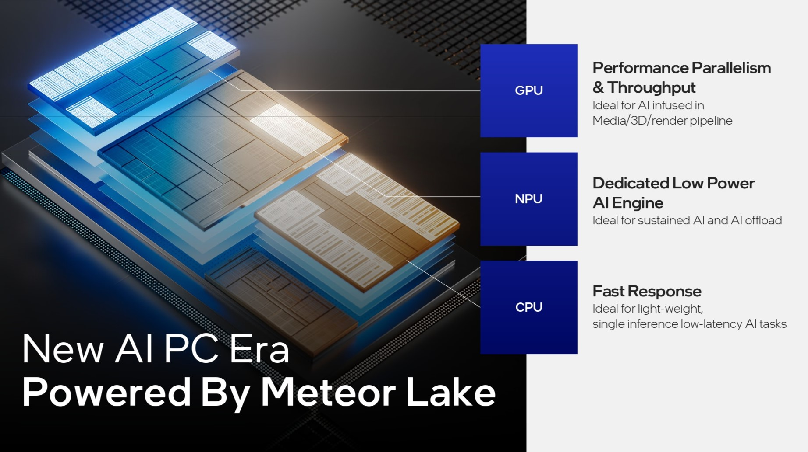
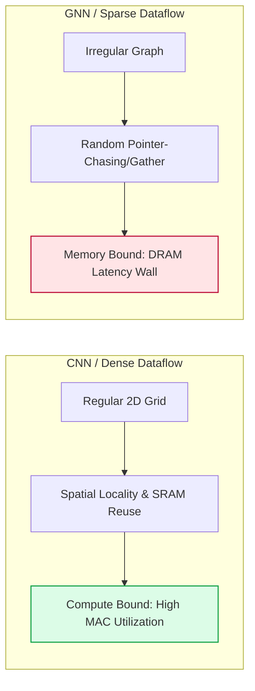
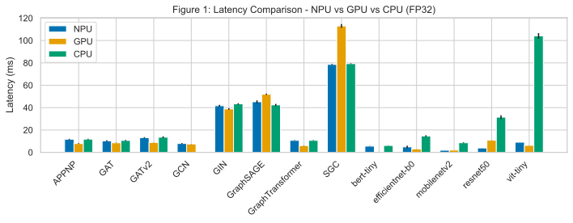
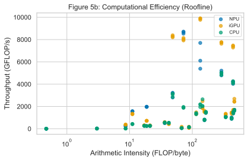
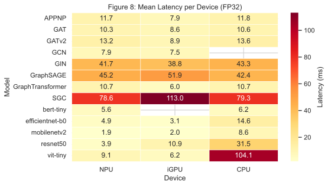
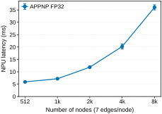
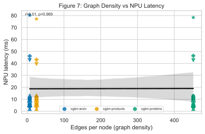
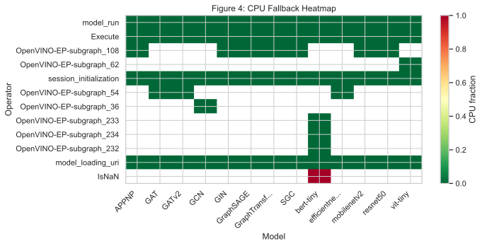
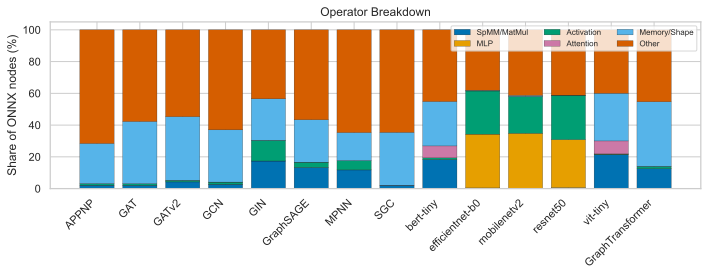

  

    

      <h1 class="text-3xl font-extrabold text-blue-800 leading-tight">
        Benchmarking GNN Inference on the Intel Core Ultra NPU
      </h1>
      <h4 class="text-slate-500 font-medium text-sm mt-1">A Latency, Quantization, and Energy Analysis</h4>
      <h3 class="text-slate-600 font-semibold mt-2 text-lg leading-relaxed">
        Heterogeneous Edge AI Analysis on Meteor Lake SoC
      </h3>
    

    

      

        
        

          Figure 1: Intel Meteor Lake heterogeneous SoC
        

      

    

  

  

    

      Yusuf Talha ARABACI, Emrullah DEMİRAL, Ömer Faruk ACAR
    

    

      Department of Software Engineering, Karabük University, Karabük, Turkey
    

    

      yusuftalhaarabaci@hotmail.com | emrullahdemiral@karabuk.edu.tr | farukacar@karabuk.edu.tr
    

  

<Glossary :terms="['npu', 'igpu', 'meteor-lake', 'soc']" />

---
layout: default
class: rq-slide
---

## Agenda
### Presentation Outline

  

    

      1
      
<strong>Background &amp; Motivation</strong> — NPU promise, GNN challenges, study goals

    

  

  

    

      2
      
<strong>Methodology</strong> — Hardware platform, 14 models, 3 OGB datasets, measurement protocol

    

  

  

    

      3
      
<strong>Results</strong> — Latency, INT8 quantization, operator analysis, roofline, density, energy

    

  

  

    

      4
      
<strong>Key Findings &amp; Bottlenecks</strong> — Why INT8 fails, CPU fallback, comparative landscape

    

  

  

    

      5
      
<strong>Practical Guidance</strong> — Deployment recommendations, future work, limitations

    

  

<Glossary :terms="['npu', 'gnn', 'openvino']" />

---
layout: default
---

## The Paradox of Edge AI Acceleration
### Dense Optimization vs. Sparse Reality

  

    <h3 class="text-blue font-semibold">1. Hardware Hype (Dense)</h3>
    <ul>
      <li>Modern SoCs (Intel Meteor Lake, Apple M-series, Qualcomm Snapdragon) integrate Neural Processing Units (NPUs).</li>
      <li>NPUs excel at <strong>dense, regular computations</strong> (e.g., 2D grid convolutions in CNNs, matrix multiplies in Transformers).</li>
      <li>They rely on high <strong>spatial locality</strong> and predictable data streaming to maximize on-chip SRAM reuse.</li>
    </ul>
  

  

    <h3 class="text-rose font-semibold">2. Graph Reality (Sparse)</h3>
    <ul>
      <li>GNN neighborhood aggregation aggregates node features irregularly:</li>
    </ul>
$$h_v^{(l+1)} = \text{UPDATE}^{(l)} \left( h_v^{(l)}, \text{AGGREGATE}^{(l)} \left( \{ h_u^{(l)} : u \in \mathcal{N}(v) \} \right) \right)$$
    <ul>
      <li>Computations rely on irregular Sparse-Dense Matrix Multiplications (SpMM):</li>
    </ul>
$$Y = A \cdot X$$
    <ul>
      <li>Memory accesses are dynamic and sparse, disrupting hardware prefetchers.</li>
      <li><strong>Result:</strong> NPUs stall waiting for DRAM transfers, leaving compute units underutilized.</li>
    </ul>
  

<Glossary :terms="['gnn', 'compute-bound', 'memory-bound', 'stalls', 'locality', 'scatter-gather']" />

---
layout: default
---

## Key Technical Inquiries
### Core Research Questions

  

    
RQ 1: On-Device Efficiency & Parity

    
How efficient are consumer NPUs for sparse GNN workloads vs. CPU and iGPU on laptops?

  

  

    
RQ 2: The Quantization Speedup Fallacy

    
Does INT8 deliver advertised 4× acceleration on NPUs, or does it trigger regressions?

  

  

    
RQ 3: Compiler Maturity & Operator Fusion Limits

    
How robust is OpenVINO when lowering Gather/Scatter onto NPU microarchitectures?

  

<Glossary :terms="['openvino', 'operator-fusion', 'cpu-fallback', 'scatter-gather']" />

---
layout: default
---

## Dense vs. Sparse Dataflow
### Visual Comparison

<Glossary :terms="['compute-bound', 'memory-bound', 'scatter-gather']" />

---
layout: default
---

## Hardware & Software Methodology
### Experimental Configuration

  

    <h3 class="font-semibold text-blue">Hardware Platform</h3>
    <ul>
      <li><strong>Processor:</strong> Intel Core Ultra 5 125H (Meteor Lake)</li>
      <li><strong>Backends:</strong>
        CPU 14 Cores (4P+8E+2LPE)
        iGPU 7 Xe-cores
        NPU AI Boost 3720
      </li>
      <li><strong>Memory:</strong> 16 GB LPDDR5x</li>
    </ul>
  

  

    <h3 class="font-semibold text-blue">Software Stack</h3>
    <ul>
      <li><strong>Framework:</strong> OpenVINO 2024.1 + ONNX Runtime 1.18</li>
      <li><strong>Protocol:</strong> 5 warm-up, 100 timed iterations, 3 repeats</li>
      <li><strong>Telemetry:</strong> Intel SoCWatch PMT CLI for package power</li>
    </ul>
  

<Glossary :terms="['socwatch', 'warm-up', 'lpddr5x', 'xe-lpg']" />

---
layout: default
---

## Evaluated Models and OGB Datasets
### Workload Characterization

  

    <h3 class="font-semibold text-blue">14 Model Architectures</h3>
    

      <strong>Graph Neural Networks (9):</strong>
      <ul>
        <li>Spectral GNNs: GCN, SGC</li>
        <li>Spatial/Expressive GNNs: GIN, GraphSAGE, MPNN</li>
        <li>Propagation/Attentional: APPNP, GAT, GATv2, GraphTransformer</li>
      </ul>
      <strong class="mt-2 block">Dense Baselines (5):</strong>
      <ul>
        <li>Convolutions: ResNet50, MobileNetV2, EfficientNet-B0</li>
        <li>Attention: ViT-Tiny, BERT-Tiny</li>
      </ul>
    

  

  

    <h3 class="font-semibold text-blue">3 Real-world Graph Datasets</h3>
    

      Drawn from the Open Graph Benchmark (dataset_stats.csv):
    

    <table>
      <thead>
        <tr>
          <th>Dataset</th>
          <th>Nodes</th>
          <th>Edges</th>
          <th>Features</th>
          <th>Edges/Node</th>
        </tr>
      </thead>
      <tbody>
        <tr>
          <td><strong>ogbn-arxiv</strong></td>
          <td>169K</td>
          <td>1.16M</td>
          <td>128</td>
          <td>6.9</td>
        </tr>
        <tr>
          <td><strong>ogbn-products</strong></td>
          <td>2.45M</td>
          <td>61.9M</td>
          <td>100</td>
          <td>25.3</td>
        </tr>
        <tr>
          <td><strong>ogbn-proteins</strong></td>
          <td>87.6K</td>
          <td>39.6M</td>
          <td>8</td>
          <td>451.7</td>
        </tr>
      </tbody>
    </table>
  

<Glossary :terms="['sparse-graph', 'dense-graph', 'adjacency-matrix', 'ogb']" />

---
layout: default
---

## Inference Latency: NPU vs. CPU vs. iGPU
### High-Contrast Performance Profile (FP32)

  

    <ul>
      <li><strong>Dense Acceleration:</strong> NPU massively accelerates vision models:
        <ul>
          <li>MobileNetV2: <strong>1.90 ms</strong> NPU vs. 8.60 ms CPU (<strong>4.5&times;</strong>)</li>
          <li>ResNet50: <strong>3.94 ms</strong> vs. 31.47 ms (<strong>8.0&times;</strong>)</li>
          <li>ViT-Tiny: <strong>9.10 ms</strong> vs. 104.13 ms (<strong>11.4&times;</strong>)</li>
        </ul>
      </li>
      <li><strong>GNN Parity:</strong> Close CPU-NPU (&plusmn;6%) — DRAM-bound.</li>
      <li><strong>iGPU leads GNNs:</strong> GraphTransformer 6.03 ms GPU vs. 10.72 ms NPU.</li>
    </ul>
  

  
  

    
    Figure 1: Latency across backends
  

<Glossary :terms="['npu', 'igpu', 'memory-bound', 'vit']" />

---
layout: default
---

## Counter-Intuitive INT8 Quantization Results
### Quantization Paradox & Silent Fallbacks

  

    <ul>
      <li><strong>Minor-to-Negative Gains on NPU:</strong> GCN (1.04&times;), GraphSAGE (1.05&times;) marginal; SGC shows <strong>2.2&times; regression</strong> (173.9 vs 78.6 ms).</li>
      <li><strong>Compilation Failures:</strong> GAT, GATv2, EfficientNet-B0 fail INT8 lowering entirely.</li>
      <li><strong>Silent CPU Fallback:</strong> Quantized vision models (MobileNetV2, BERT-Tiny) silently run on CPU, giving misleading "NPU" latencies.</li>
    </ul>
    

      <strong>Why?</strong> INT8 does not reduce DRAM traffic for memory-bound sparse workloads. Dynamic quantization patterns collide with the NPU's static-shape architecture.
    

  

  

    
    Figure 2: INT8 speedup heatmap. Red (&lt; 1.0) = degradation.
  

<Glossary :terms="['int8', 'regression', 'cpu-fallback', 'static-shape', 'scatter-gather']" />

---
layout: default
---

## Structured vs. Irregular Attention Patterns
### ViT-Tiny vs. GraphTransformer on NPU

  

    <h3 class="font-semibold text-emerald" style="font-size:0.85rem">Structured (ViT-Tiny)</h3>
    <ul>
      <li>Self-attention over fixed 2D grid patches.</li>
      <li>Static, predictable strides → max fusion.</li>
      <li><strong>NPU speedup:</strong> 11.4&times; vs CPU</li>
    </ul>
  

  

    <h3 class="font-semibold text-rose" style="font-size:0.85rem">Irregular (GraphTransformer)</h3>
    <ul>
      <li>Attention over dynamic graph neighborhoods.</li>
      <li>Irregular indices → random DRAM queries.</li>
      <li><strong>NPU speedup:</strong> 1.0&times; vs CPU</li>
    </ul>
  

  Despite <strong>30&times; fewer parameters</strong> (0.18M vs 5.7M), GraphTransformer gains no NPU speedup.

<Glossary :terms="['structured-attention', 'irregular-attention', 'vit']" />

---
layout: default
---

## Roofline Analysis & Computational Efficiency
### Memory Bandwidth Wall vs. Compute Saturation

  

    <ul>
      <li><strong>Intensity</strong> <KaTeX math="= \text{FLOPs} / \text{Bytes}" /> — operational density per memory transfer.</li>
      <li><strong>Memory-bound GNNs:</strong> 0.1–10 FLOP/byte — limited by LPDDR5x bandwidth, explaining no NPU gain.</li>
      <li><strong>Compute-bound vision:</strong> CNNs/ViT saturate NPU's MAC arrays in higher intensity zones.</li>
    </ul>
  

  

    
    Figure 5: Throughput vs. arithmetic intensity
  

<Glossary :terms="['compute-bound', 'memory-bound', 'intensity', 'roofline', 'lpddr5x']" />

---
layout: default
---

## Power Consumption and Throughput per Watt
### SoCWatch Package-Level Telemetry

  

    <ul>
      <li><strong>Formula:</strong> <KaTeX math="E_{\text{inf}} = P_{\text{package}} \times t_{\text{latency}}" /></li>
      <li><strong>iGPU:</strong> +7.3% peak power vs CPU, but faster — equal energy/inference.</li>
      <li><strong>INT8 on CPU:</strong> GCN −18.4% energy (73.4 vs 89.9 mJ); MPNN +59% (301.1 vs 189.3 mJ).</li>
    </ul>
  

  

    <table>
      <thead>
        <tr>
          <th>Model</th>
          <th>Config</th>
          <th>Power (mW)</th>
          <th>Lat (ms)</th>
          <th>Energy (mJ)</th>
        </tr>
      </thead>
      <tbody>
        <tr style="background-color: #f8fafc">
          <td><strong>GCN</strong></td>
          <td>CPU FP32</td><td>11,629</td><td>7.73</td><td>89.9</td>
        </tr>
        <tr>
          <td><strong>GCN</strong></td>
          <td>CPU INT8</td><td>9,675</td><td>7.59</td><td><strong>73.4</strong></td>
        </tr>
        <tr style="background-color: #f8fafc">
          <td><strong>GCN</strong></td>
          <td>GPU FP32</td><td>12,482</td><td>6.94</td><td>86.6</td>
        </tr>
        <tr>
          <td><strong>MPNN</strong></td>
          <td>CPU FP32</td><td>9,357</td><td>20.23</td><td>189.3</td>
        </tr>
        <tr style="background-color: #f8fafc">
          <td><strong>MPNN</strong></td>
          <td>CPU INT8</td><td>9,139</td><td>32.94</td><td><strong>301.1</strong></td>
        </tr>
      </tbody>
    </table>
  

<Glossary :terms="['socwatch', 'throughput-watt']" />

---
layout: default
---

## Cross-Platform Latency Overview
### Heatmap Across Models, Devices, and Precisions

  

    <ul>
      <li><strong>iGPU Dominance:</strong> Lowest latency across GNNs and vision.</li>
      <li><strong>NPU Sweet Spot:</strong> Dense vision (ResNet50, MobileNetV2, ViT) — 4.5–11.4× vs CPU.</li>
      <li><strong>GNN Parity:</strong> All backends cluster tightly — memory-bound bottleneck is platform-independent.</li>
    </ul>
  

  

    
    Figure 8: FP32 latency heatmap (14 models &times; 3 backends)
  

<Glossary :terms="['npu', 'igpu', 'memory-bound', 'onnx']" />

---
layout: default
---

## Scaling Characteristics on NPU
### Graph Size vs. Latency

  

    <ul>
      <li><strong>Flat latency:</strong> Unlike CPU/GPU, NPU latency stays constant across node/edge counts.</li>
      <li><strong>Why?</strong> ONNX Runtime compiles with statically shaped tensors — fixed throughput regardless of input.</li>
      <li><strong>Trade-off:</strong> Predictable latency, but no benefit from sparser subgraphs.</li>
    </ul>
  

  

    
    Figure 6: Flat NPU latency across graph sizes
  

<Glossary :terms="['memory-bound', 'npu', 'static-shape', 'onnx']" />

---
layout: default
---

## Impact of Graph Density on NPU Efficiency
### Density-Latency Decoupling

  

    <ul>
      <li><strong>Pearson <KaTeX math="r \approx -0.00" /></strong> — no correlation between density &amp; latency on NPU.</li>
      <li><strong>Dataset sweep:</strong> arxiv (6.9 edges/node), products (25.3), proteins (451.7) — two orders of magnitude.</li>
      <li><strong>Static-shape compilation</strong> forces constant throughput regardless of sparsity.</li>
    </ul>
    

      <strong>🔑</strong> NPU latency is <strong>completely decoupled</strong> from graph density. Unlike CPU/GPU, sparser subgraphs yield no speedup.
    

  

  

    
    Figure 7: Flat latency across density levels
  

<Glossary :terms="['sparse-graph', 'adjacency-matrix', 'spmm', 'static-shape']" />

---
layout: default
---

## Why Do GNNs Struggle on Consumer NPUs?
### Key Architectural Bottlenecks

  

    <ul>
      <li><strong>1. Memory Wall:</strong> GNNs are memory-bound (0.1–10 FLOP/byte). 2–4× more shape operators (Gather, Scatter) than vision models — poorly served by NPU's streaming-dataflow.</li>
      <li><strong>2. Compiler Fusion Limits:</strong> Indirect indexing (Gather, Scatter) prevents static flow optimization; fewer fusion passes on GNN subgraphs.</li>
      <li><strong>3. Operator Coverage:</strong> MPNN fails entirely on NPU — <code>index_add_</code> unsupported, forcing 100% CPU fallback.</li>
    </ul>
  

  

    
    Figure 4: CPU fallback fraction per model.
  

<Glossary :terms="['memory-bound', 'operator-fusion', 'cpu-fallback', 'spmm', 'scatter-gather']" />

---
layout: default
---

## Operator Composition Analysis
### GNNs vs. Vision Models

  

    <ul>
      <li><strong>GNNs:</strong> MatMul (30–60%), 2–4× more Gather/Scatter/Reshape than vision.</li>
      <li><strong>Vision:</strong> Conv (50–80%), minimal shape manipulation.</li>
      <li><strong>Insight:</strong> Gather/Scatter irregularity clashes with NPU's streaming-dataflow.</li>
    </ul>
  

  

    
    Figure 3: Operator composition — GNNs vs. vision
  

<Glossary :terms="['spmm', 'operator-fusion', 'cpu-fallback', 'scatter-gather']" />

---
layout: default
---

## Intel AI Boost: Failure Mode Analysis
### Silent CPU Fallback as a Toolchain Maturity Signal

  

    <h3 class="font-semibold text-rose">Observed Failure Modes on Meteor Lake NPU</h3>
    <ul>
      <li><strong>Silent CPU Fallback:</strong> OpenVINO silently dispatches unsupported quantized ops to CPU — MobileNetV2, ResNet50, BERT-Tiny INT8 report misleading "NPU" latencies identical to CPU execution.</li>
      <li><strong>Compilation Rejection:</strong> GAT, GATv2, EfficientNet-B0 fail INT8 lowering entirely — dynamic Gather/Scatter unsupported in NPU quantized operator set.</li>
      <li><strong>Full Backend Bypass:</strong> MPNN's <code>index_add_</code> and <code>scatter_mean</code> operators lie outside the NPU plugin — 100% CPU fallback regardless of designated backend.</li>
    </ul>
  

  

    <h3 class="font-semibold text-blue">Root Cause</h3>
    <ul>
      <li>Quantization toolchain assumes dense, regular computation graphs — GNNs violate this contract at every level.</li>
      <li>Halving arithmetic precision (FP32 → INT8) does not reduce DRAM traffic for memory-bound sparse workloads.</li>
      <li>As NPU compilers mature toward explicit mixed-precision support, operator coverage should expand; the memory-bandwidth bottleneck will persist for any streaming-dataflow architecture without sparse acceleration.</li>
    </ul>
  

<Glossary :terms="['npu', 'cpu-fallback', 'int8', 'scatter-gather']" />

---
layout: default
---

## Scientific Limitations & Threats to Validity
### Experimental Constraints

  

    <ul>
      <li><strong>Single platform:</strong> Results restricted to Core Ultra 5 125H. Memory SKU variations affect bandwidth.</li>
      <li><strong>Power telemetry:</strong> SoCWatch cannot isolate NPU rail — Meteor Lake PMT counters lack an NPU power/energy rail definition. Package-level CPU/GPU only.</li>
      <li><strong>Future work:</strong> Shunt resistors &amp; oscilloscope for isolated NPU power measurement.</li>
    </ul>
  

  

    <ul>
      <li><strong>Energy model:</strong> <KaTeX math="E = P \times t" /> assumes stationary power; background OS activity not isolated.</li>
      <li><strong>Statistics:</strong> Bootstrap 95% CIs per config; paired hypothesis tests across devices pending.</li>
    </ul>
  

<Glossary :terms="['socwatch', 'warm-up', 'onnx']" />

---
layout: default
---

## Practical Guidance for Edge AI Deployments
### System Guidelines and Future Roadmap

  

    
✔ Recommended: Dense Vision on NPU (FP32)

    

      Deploy vision networks (ResNet50, MobileNetV2) and regular transformers to the <strong>NPU</strong> at <strong>FP32</strong> (4.5–11.4× vs CPU). Avoid INT8 for vision on NPU — toolchain silently falls back to CPU.
    

  

  

    
⚠ Caution: GNN Workloads on GPU (FP32)

    

      Deploy GNNs (GCN, GraphSAGE, GraphTransformer) to the <strong>iGPU</strong> at <strong>FP32</strong>. Avoid NPU due to compilation failures, memory bottlenecks, and silent fallbacks (OpenVINO 2024.1).
    

  

---
layout: default
---

## Key Findings Summary
### What This Study Reveals

  

    <h3 class="text-emerald font-bold" style="font-size:0.8rem">✅ NPU Excels For</h3>
    <ul class="text-xs" style="margin:0">
      <li>Dense vision at <strong>FP32</strong> (4.5–11.4× vs CPU)</li>
      <li>Structured attention (ViT: 11.4×)</li>
    </ul>
  

  

    <h3 class="text-rose font-bold" style="font-size:0.8rem">❌ NPU Struggles With</h3>
    <ul class="text-xs" style="margin:0">
      <li>GNNs: CPU parity (±6%), no acceleration</li>
      <li>INT8: 0.45–1.21× (SGC: 2.2× regression)</li>
    </ul>
  

  

    <h3 class="text-blue font-bold" style="font-size:0.8rem">📊 Best GNN Backend</h3>
    <ul class="text-xs" style="margin:0">
      <li><strong>iGPU</strong> — lowest GNN latency</li>
      <li>Power: 9.1–12.5 W; INT8 energy model-dependent</li>
    </ul>
  

  

    <h3 class="text-amber font-bold" style="font-size:0.8rem">🔧 Toolchain Issues</h3>
    <ul class="text-xs" style="margin:0">
      <li>Silent CPU fallback for quantized models</li>
      <li>Static-shape decouples latency from sparsity</li>
    </ul>
  

<Glossary :terms="['npu', 'igpu', 'int8', 'cpu-fallback', 'static-shape']" />

---
layout: default
---

## Key References
### Selected Bibliography

  

    <ul style="font-size:0.7rem">
      <li><strong>Meteor Lake</strong> — Intel Hot Chips 2023, Foveros 3D packaging</li>
      <li><strong>GNN Accelerators</strong> — HyGCN (ISPASS 2020), EnGN (ISCA 2020), GRIP (HPCA 2021)</li>
      <li><strong>OpenVINO NPU</strong> — Intel NPU plugin, operator coverage, IR pipeline</li>
      <li><strong>MLPerf Inference</strong> — Standardized benchmark suite</li>
    </ul>
  

  

    <ul style="font-size:0.7rem">
      <li><strong>OGB Datasets</strong> — Hu et al., NeurIPS 2020</li>
      <li><strong>Roofline on Edge</strong> — Bi et al., arXiv 2026</li>
      <li><strong>GNN Architectures</strong> — GCN (Kipf 2017), GAT (2018), GraphSAGE (2017), MPNN (2017)</li>
    </ul>
  

<Glossary :terms="['openvino', 'gnn', 'npu']" />

---
layout: default
---

  <h1 class="text-3xl font-extrabold text-blue-800 text-center">Thank You!</h1>
  <h3 class="text-xl text-slate-600 font-semibold">Questions &amp; Discussion</h3>
  
  

    

      

        Yusuf Talha ARABACI, Emrullah DEMİRAL, Ömer Faruk ACAR
      

      

        Department of Software Engineering, Karabük University
      

      

        <strong>Paper &amp; Data:</strong> 
        <a href="https://github.com/yusufarbc/intel-npu-gnn-benchmarking" target="_blank" class="text-blue-600 underline font-medium">
          github.com/yusufarbc/intel-npu-gnn-benchmarking
        </a>
      

      

        <strong>Contact:</strong> yusuftalhaarabaci@hotmail.com
      

    

    

      
      
Scan me

    

  

<Glossary :terms="['npu', 'igpu', 'int8', 'fp32']" />
